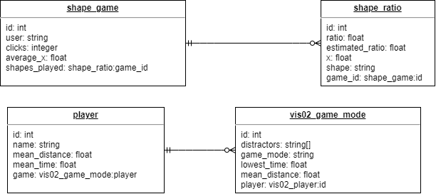

# Visualisation 2021
by [Julian Bechthold](https://github.com/Huliandos) and [Florian Reitz](https://github.com/troppes)

This repository contains our files for the visualisation module at HTW in 2021.
All the references to the database were removed, since the server is no longer available. If you want to create your own database, here is the table structure:

We used [Directus](https://github.com/directus/directus) for our backend.

### Vis01 - Circle Game
In this game the goal is to match the written size difference of the shape as closely as you can.

### Vis02 - Preattentive perception
In this game the goal is to click on the outlier.

### Vis03 - Car Watcher
This is a visualisation of a list of cars given by the professor.

## Installation and running

To build and run the program please use 'mvn clean javafx:run' within the project folder.

## Thanks

A big thanks to Filip Papranec for his [car logo repo](https://github.com/filippofilip95/car-logos-dataset), which we used for Vis03.